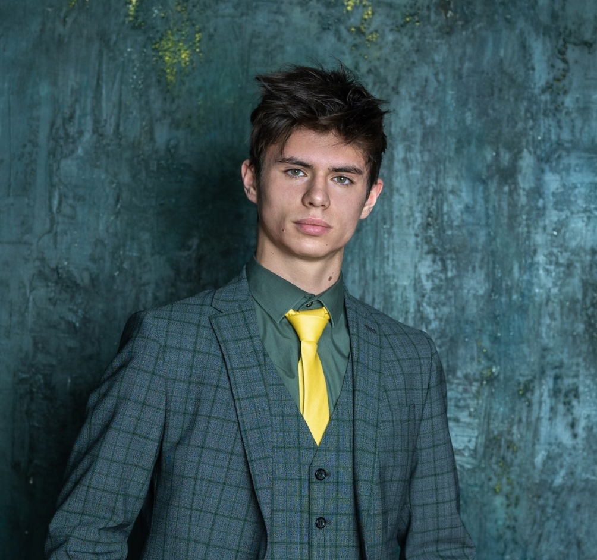

# Привет! 👋  

Я — **Новокещенов Егор**, студент университета иннополис, ML инженер & разработчик ПО. 

Бысторо учусь, умею делегировать и работать в команде, эффективно использовать AI.

Добро пожаловать на мой GitHub-профиль

---

## 🔧 Навыки  
|                                  | Уровень      |
|----------------------------------|--------------|
| Python                           | ★★★★☆        |
| ML/Deep Learning                 | ★★★☆☆        |
| Computer Vision / CV архитектуры | ★★★☆☆        |
| Flutter / Swift                  | ★★☆☆☆        |
| Java / алгоритмы                 | ★★★☆☆        |
| Docker / MLOps / инфраструктура  | ★☆☆☆☆        |
| Unity                            | ★★☆☆☆        |

---

## Хакатоны:
- Международный хакатон от Цифрового прорыва. RAG система
- ВШЭ ПСБ&. прогнозирование платежеспособности клиентов
- Rutube. проблема холодного старта.
- AIDAO. генерация битов защиты в системе квантовых вычислений

[**дипломы**](https://disk.yandex.ru/client/disk/%D0%B4%D0%B8%D0%BF%D0%BB%D0%BE%D0%BC%D1%8B)

---
## Комерческие проекты:
- **Эндоскопическое приложение** — просмотр видео обследований + модели детекции полипов (PraNet/YOLO) + интерфейс с поддержкой скриншотов и голосового управления. (6 месяцев)
  - Стэк:
    + Python
    + CV2
    + Yolo
    + Vosk
    + SQLite
    + dart/flutter
  - Моя зона ответсвенности:
    - Тимлид команды.
    - Реазизовал чать интерфейса.
    - Логику приложения.
    - Ресерчь подходящих архитектур для детекции полипов / распознования голоса.
    - Подготовил несколько датасетов с полипами.
    - Дообучил YoloV8.
    - Встроил Vosk для распознования голосовых команд.

- **RAG-система для юридической сферы** - сервис для ускорения работы Юристов. RAG поиск по открытым базам с делами. RAG поиск по личной базе данных. (
  - стэк:
    + Python
    + langchain
    + Llama
    + SQLite
  - Моя зона ответсвенности:
    + Тимлид команды.
    + реализовал Encoder.
    + взаимодейсвие с vector database.
    + логика RAG системы.
   
## Пет-проекты:
- **Reinforcement Learning Гонщик** - учебный проект, кастомное окружение с агентом-гонщиком. наглядно показывается как агент приспосабливается к кправлению и трассе.
  - Стэк:
    + Python
    + pyGames
    + Stable-Baselines3
    + gum
  - Моя зона ответсвенности:
    + весь проект (кастомное окружение, агент, отрисовка)
   
## учебные проекты:
- **A_Star и backtracking алгоритмы визуализация** - проект в рамках AI курса. Алгорим генерирует карту и запускает тестировщик одного из двух алгоритмов. все визуализируется в отдельном окне.
  - Стэк:
    + Python
    + Pygames
  -  Моя зона ответсвенности:
    + алгоритмы нахождения пути
    + адаптация тестировщика под визуализацию
    + визуализация

---
## 🚀 Что я ищу  
Я открыт для роли ML-инженера или смежной позиции, где могу:  
- проектировать и внедрять ML/Deep Learning-решения в продакшн,  
- работать с большими и интересными проектами,  
- решать нетривиальные задачи, 
Если в вашей команде нужен инженер, который увлечён ML, стремится к чистому архитектурному коду, быстро учится и способен перейти от прототипа к промышленному решению — Я буду рад стать частью вашей команды.

---

## 📫 Контакты  
- E-mail: egornava.13@gmail.com
- LinkedIn: https://www.linkedin.com/in/egor-novokreshchenov-6a8781395/?trk=opento_sprofile_goalscard
- HH: https://innopolis.hh.ru/resume/52d7f9c3ff0f462cb60039ed1f677257684f55
- Telegram: @E_Novokreshchenov  

---

## хобби
- Делаю инди игры на юнити.
- Много спорта: футбол, сноубординг, единаборства.
- Творчество: Пишу, учусь играть на пианино.
- Языки: английский В2, испанский А2.

Спасибо за внимание!  
Буду рад новым возможностям и интересным задачам.  
